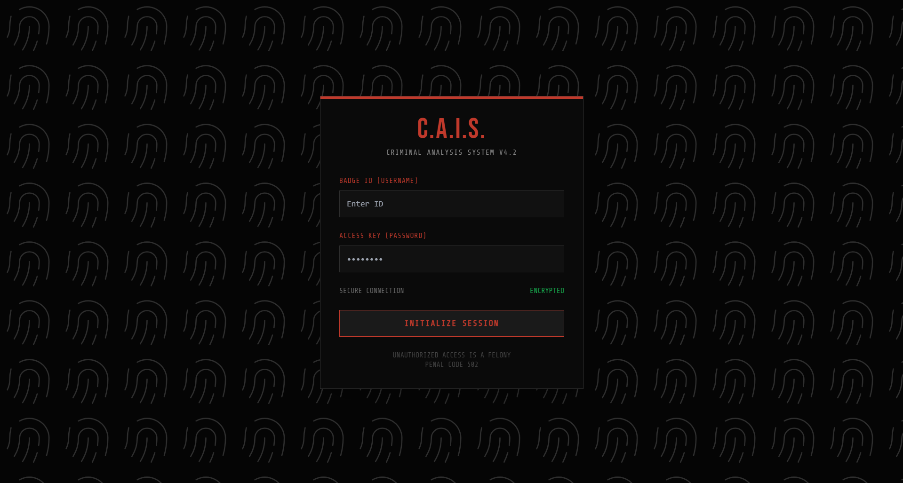
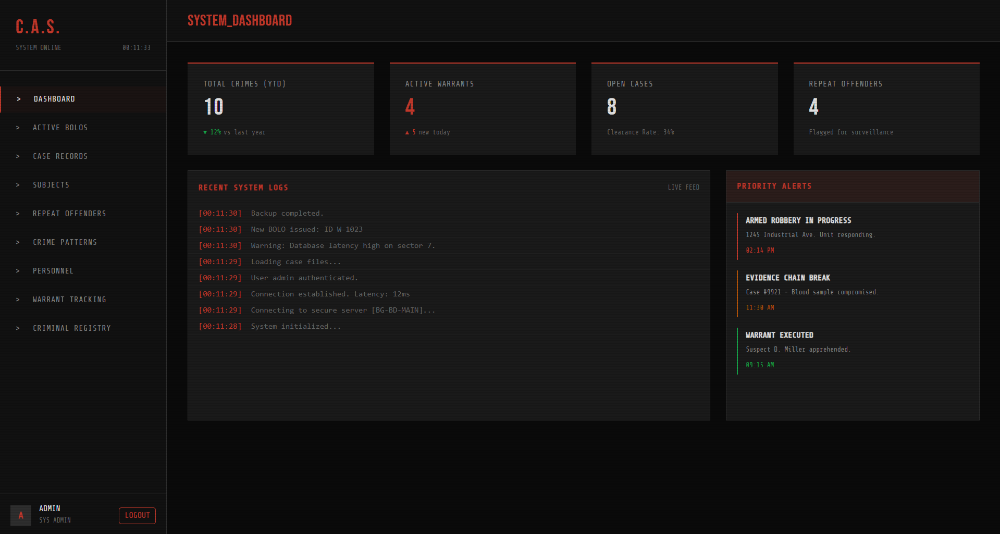
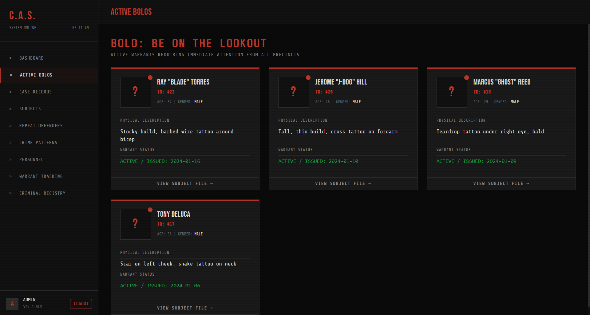
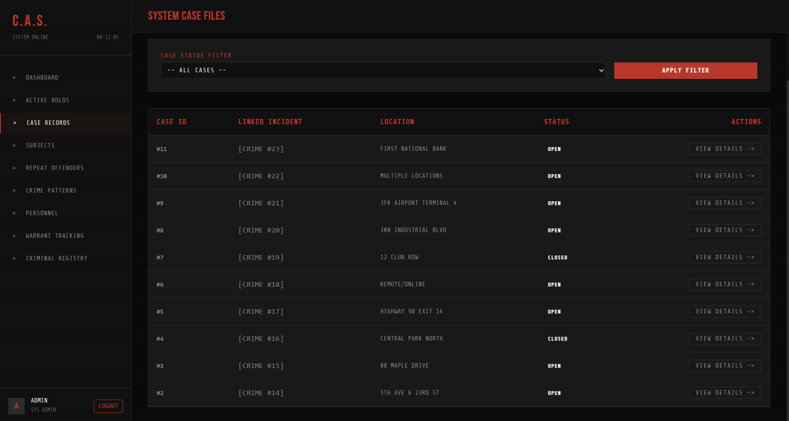
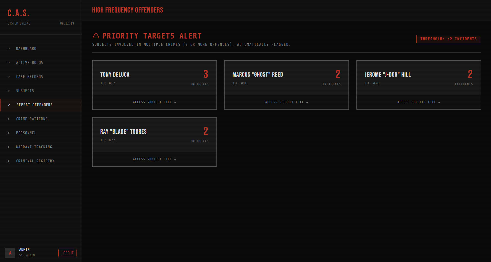
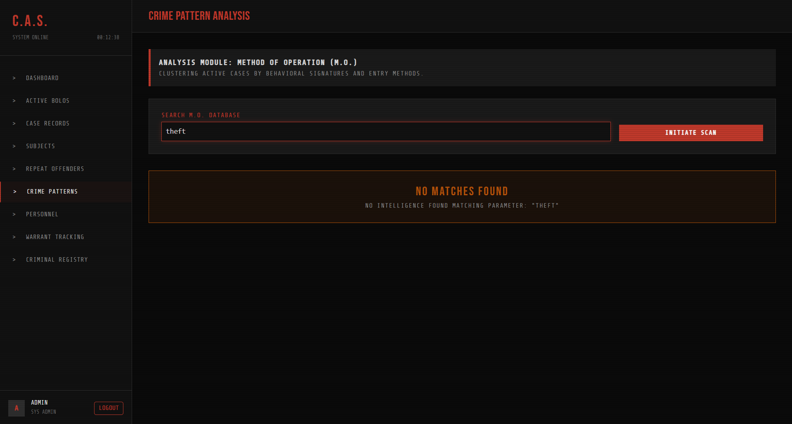
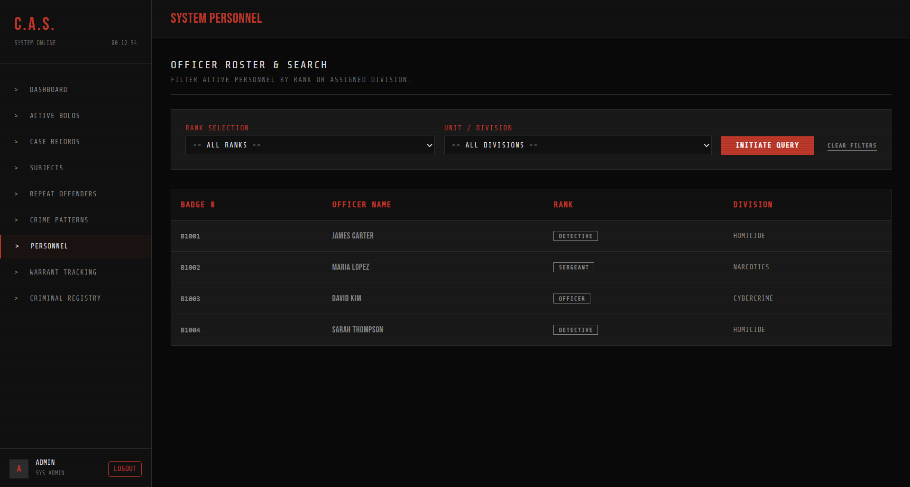
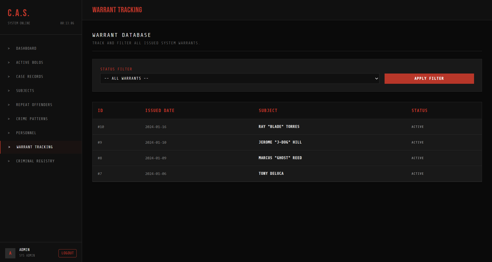

# Criminal Analysis & Investigation System (CAIS)

Course Code: CSE370

A robust, law-enforcement web application built to track criminal profiles, manage investigations, log evidence, and identify crime patterns using advanced data relationships. Recently rebuilt in a flat, page-oriented structure using **Raw SQL** to demonstrate core database concepts.

## ✨ Overview

CAIS helps police departments and administrators organize officer squads, track repeat offenders, match crime patterns (M.O.), and maintain secure chains of evidence—ensuring public safety and more efficient investigations.

- 🗺️ **Crime Pattern Finder** (links crimes with the same method/trick)
- 📚 **Repeat Offender Alerts** (automatically flags high-frequency criminals)
- 📝 **Warrants & BOLO** (Be On the Lookout) tracking for public safety
- 👥 **Officer & Team** tracking (manage shifts, divisions, and ranks)
- 🛠️ **Master Criminal Index** & interrogation logs
- 🏛️ **Case and Court Date** management

## 📦 Tech Stack

- **Frontend:** HTML, CSS (Tailwind), Vanilla JavaScript
- **Backend:** Python (Django used for routing/templates; Logic is in top-level `.py` files)
- **Database:** MySQL
- **Query Style:** Raw SQL directly in feature page files

## 🏗️ Project Architecture

To make the codebase easier to understand and present, major features are split into their own individual Python files (similar to a flat PHP project structure):
- **Core Nav:** `index.py`, `dashboard.py`, `features.py`
- **Personnel:** `OfficerSearch.py`, `ShiftTracking.py`
- **Suspects:** `CriminalList.py`, `CriminalProfile.py`, `CriminalRegistry.py`
- **Crimes & Cases:** `CrimeList.py`, `CrimeDetail.py`, `CrimePatternFinder.py`, `CaseRecords.py`, `CaseDetail.py`
- **Legal:** `WarrantTracking.py`, `BOLOList.py`, `CourtCalendar.py`, `CourtDetail.py`
- **Database:** Raw SQL dumps and schemas are maintained in the `Database/` directory.

## 🧩 Feature Matrix

| Sl  | Feature Name                | Type                 | Implementation File             | Notes                                                             |
| --- | --------------------------- | -------------------- | ------------------------------- | ----------------------------------------------------------------- |
| 1   | **Admin Authentication**    | —                    | `login.py`                      | Secure session-based login for authorized personnel only.         |
| 2   | **Officer Directory**       | Create, Read, Update | `OfficerSearch.py`              | Manage officer names, ranks, and badge numbers.                   |
| 3   | **Team Management**         | Create, Read, Update | `OfficerSearch.py`              | Assign officers to specific squads (e.g., Homicide, Narcotics).   |
| 4   | **Shift Tracking**          | Create, Read         | `ShiftTracking.py`              | Record officer work dates and hours logged.                       |
| 5   | **Criminal Registry**       | Create, Read, Update | `CriminalList.py`               | Store physical traits, age, gender, and profile status.           |
| 6   | **Alias/Nickname Tracking** | Create, Read, Delete | `CriminalProfile.py`            | Record and manage multiple street names per subject.              |
| 7   | **Warrant Tracking**        | Create, Read, Update | `WarrantTracking.py`            | Track "Active" or "Cancelled" bench warrants.                     |
| 8   | **BOLO List**               | Read                 | `BOLOList.py`                   | Specialized view filtering only 'Active' warrants.                |
| 9   | **Crime Records**           | Create, Read, Update | `CrimeList.py`                  | Log locations, dates, and methods of operation (M.O.).            |
| 10  | **Crime Pattern Finder**    | Read                 | `CrimePatternFinder.py`         | Identify linked crimes sharing the same operational tactics.      |
| 11  | **Evidence Vault**          | Create, Read, Delete | `CrimeDetail.py`                | Attach weapons, devices, and physical items to specific cases.    |
| 12  | **Victim Roster**           | Create, Read, Update | `CrimeDetail.py`                | Store affected individuals' names and secure contact numbers.     |
| 13  | **Case Lifecycle**          | Create, Read, Update | `CaseRecords.py`                | Manage case status (e.g., "Open" or "Finished").                  |
| 14  | **Legal Calendar**          | Create, Read, Update | `CourtCalendar.py`              | Track court appearance dates and presiding judges.                |
| 15  | **Repeat Offender Alert**   | Read                 | `RepeatOffenders.py`            | Aggregates crime counts to automatically flag habitual offenders. |
| 16  | **Interrogation Logs**      | Create, Read, Update | `CriminalProfile.py`            | Store private interview notes between officers and suspects.      |

## 👥 Team

- **Daud Ibrahim Hassan**
- **Abir Enam**
- **Ocean Biswas**

### 📸 Project Preview

